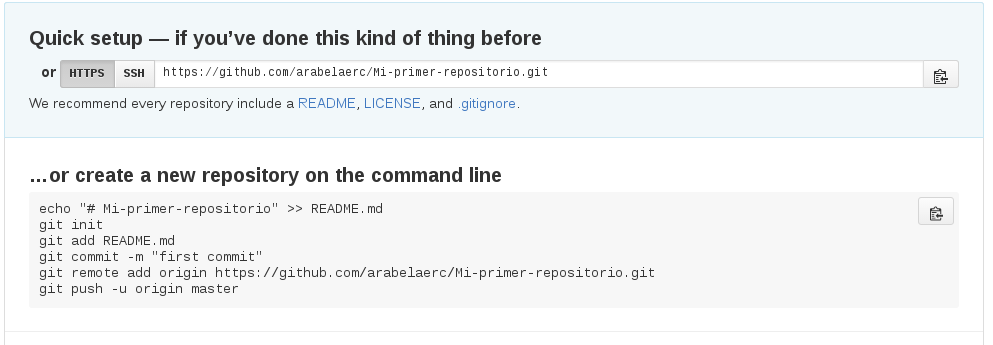
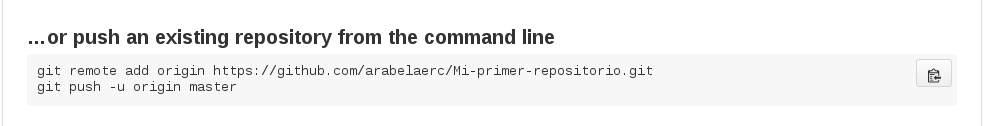

# Como realize mi ejercicio
## Crear carpetas.
###### Primero assets : contenia Una carpeta CSS,una JS y un archivo index.html;
*  GIT: 
	Abrí la terminal, ubicamos la carpeta donde queremos crear nuestro
	y seguimos con las instruciones 
	
	Subí nuestros archivos atravez de Git a la plataforma de GitHub.
	Hago los siguientes comandos:
		
	Olvide que cuando pusheas por primera vez sin un README desde GitHub,
	debes tener en cuenta el "git push -u origin master" ,desde la terminal
	donde quiero iniciar mi repocitorio local
	
	 
*  GITHUB
    
    Creamos el repositorio(Sin "readme" ) y modificamos.
    